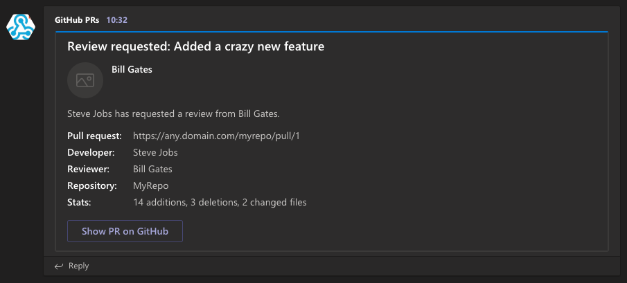

# GitHub Connector

This small app aims at posting a notification in a channel whenever a reviewer is requested for a PR in GitHub.



Originally, it was aiming at mentioning the requested reviewer, so that he/she gets a personal notif. But... the API from Teams does not allow it for now :sob:

Note that a very similar connector already exists (`GitHub Enterprise`), but it ignores notifications of type `review_requested`.

## Info

* This is a Node.js app, thus requires `npm`
* Limitations:
    * Supports only the `review_requested` events from GitHub, others events are ignored
    * Unfortunately, MS Teams does not provide an API to mention some one, which is a bit frustrating since the reviewer cannot be personally notified. In order to receive notifications, everybody has to follow the channel, and will ve notified of all review requests, which is a bit of pollution.

## Setup

There are 3 steps that must be done. Each step is described later in the doc.

1. Create an incoming WebHook in MS Teams
2. Run the app (locally or in MS Teams)
3. Create an outgoing WebHook in GitHub 

### Create an incoming WebHook in MS Teams

* Setup an incoming WebHook in your MS Teams channel ([doc](https://docs.microsoft.com/en-us/microsoftteams/platform/concepts/connectors/connectors-using#setting-up-a-custom-incoming-webhook)), and note its URL (something like `https://outlook.office.com/webhook/...`).
* Put the WebHook URL in the config file `config/default.json`.

### Run the app

The app is a simple Node.js server, and basically it must be reachable from your GitHub server. 

Two options here: 

* either run **locally** (recommenced to make a quick test), 
* or host your app on **Azure**.

**Note:** you may also setup a static internal server for your enterprise, as long as it can be reached from your GitHub enterprise.

#### Locally

* Make sure to have `npm` installed
* Clone this repo
* Move to the repo root folder and run `npm start`, the app will start on `http://localhost:3000`
* Then, in order to be reachable from Internet, you may use `ngrok` to create a temporary tunnel
    * [Download and install it](https://ngrok.com/download)
    * Then run it to bind your locally running app `./ngrok http 3000 -host-header=localhost:3000`
    * Now your local running app is reachable from Internet with something like `https://<RANDOM_ID>.ngrok.io`
    * This URL is what you have to use in GitHub, see below.

#### Host on Azure

* Follow [official doc](https://docs.microsoft.com/en-us/microsoftteams/platform/get-started/get-started-nodejs-in-azure).

### Create an outgoing WebHook in GitHub 

* Copy the URL of your running app
* In your GitHub repository: 
    * [Add a WebHook](https://developer.github.com/webhooks/creating/) in the settings, with the URL of your running app.
    * Make sure to configure it with JSON as content-type (`application/json`).
    * No need for a secret / authorization
    * Fine-tune the events that you want to be sent. Currently, only the PR review requests are supported by the connector, the other ones are ignored, so you can select option `Let me select individual events`, and then only tick checkbox `Pull requests`
    * Make sure that the WebHook is marked as `Active`
    
## Test it 

* Of course the code has some automatic tests implemented: `npm test` 
* You can simulate GitHub notification by simply send a `POST` (with Postman for example) on the app URL, with a an appropriate JSON payload, e.g.:
```json
{
    "action": "review_requested",
    "pull_request": {
        "title": "Added a crazy new feature",
        "_links": {
            "html": {
                "href": "https://any.domain.com/myrepo/pull/1"
            }
        },
        "additions": 14,
        "deletions": 3,
        "changed_files": 2
    },
    "requested_reviewer": {
        "login": "bill-gates"
    },
    "repository": {
        "name": "MyRepo"
    },
    "sender": {
        "login": "steve-jobs",
        "avatar_url": "https://www.apple.com"
    }
}
```
* From your GitHub repository:
    * Create a PR, then go to the Settings, find your WebHook and see the events it has sent. The response must be a `200 OK` but with text saying that this notif was ignored.
    * Add some one as a reviewer for your PR in GitHub, and check the WebHook event, response must be a `200 OK` without text.
    * In your channel in Teams, you should see a message.
    * Note that a message from GitHub can be redelivered, which can be nice for testing.
